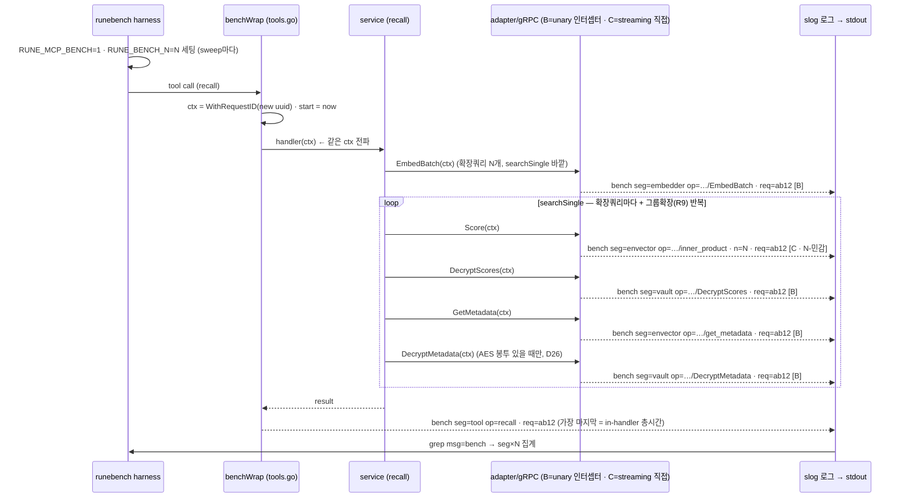

# US-1 Bench 계측 데이터 플로우

> **출처 (2026-06-18)**: `feat/us1-bench-instrumentation` 브랜치 실측.
> 대상 변경:
> - `internal/bench/bench.go` (신규) — env 게이트 계측 leaf 모듈
> - `internal/bench/bench_test.go` (신규) — 출력 계약 3종 + off=no-op 회귀 테스트
> - `internal/lifecycle/boot.go` — gRPC 클라이언트에 `withBench(...)` **unary** 인터셉터 체인 주입
> - `internal/mcp/tools.go` — 툴 핸들러에 `benchWrap(...)` 데코레이터 주입
> - `internal/adapters/envector/client.go` — **streaming**인 `Score`·`Insert`를 어댑터
>   레벨 `bench.Observe`로 직접 계측(인터셉터로 못 잡음) + 테스트용 `sdkIndex` seam
> - `internal/adapters/envector/{client_bench_test.go, encrypt_bench_test.go}` (신규) —
>   streaming 계측 회귀 테스트 + 암호화 단독 벤치
>
> 이 문서가 다루는 "데이터"는 capture/recall **요청 데이터가 아니라**, 그 요청이
> 흐를 때 **부수적으로 생성되는 측정값(bench 로그 라인)**이다. 요청 자체의 흐름은
> `docs/runed/05-capture-flow.md` · `06-recall-flow.md`가 정본이며, 이 문서는 그
> 경로 위에 **어디서 시계가 켜지고, 어떤 측정값이 어디로 흘러 나가는지**를 겹쳐
> 그린다.

---

## 0. 왜 이 계측이 존재하는가 (한 줄 맥락)

US-1은 **N(인덱스에 미리 적재된 벡터 행 수)이 늘 때 recall/capture latency가 어떻게
변하는지**를 측정한다. 요청이 거치는 단계 중 N에 민감한 것은 **envector `Score` 한
구간뿐**이고, 나머지(embed · in-process · vault decrypt)는 N-독립적이다
(`bench.go` 패키지 주석). 그래서 "단계별로 시간을 따로 찍어, N에 대한 곡선을 구간별로
분리"하는 것이 이 계측의 목적이다.

설계 핵심 한 줄: **프로덕션 바이너리 = 벤치 바이너리.** 계측은 `RUNE_MCP_BENCH=1`
환경변수 뒤에 게이트되어, 끄면 **인터셉터·데코레이터·로그가 0**이다(인터셉터/데코레이터는
boot 때 아예 미설치). 단 어댑터 레벨로 계측한 envector `Score`·`Insert` 2곳은 off여도
무시 가능한 상수 비용(`time.Now`+early-return)이 남는다 — 상세·근거는 §5.
`bench_test.go`의 Contract 1(`TestObserve_OffIsNoOp`)이 이 무해성을 회귀로 고정한다.

---

## 1. 입력 — 측정을 켜고 좌표를 찍는 두 개의 스위치

계측은 두 개의 환경변수만 읽는다. 둘 다 **harness(`runebench`)가 sweep 시점마다
세팅**하고, rune-mcp는 읽기만 한다.

| 변수 | 읽는 곳 | 의미 | 미설정 시 |
|---|---|---|---|
| `RUNE_MCP_BENCH` | `bench.Enabled()` (`bench.go:38`) | `=1`이면 계측 on. **토글을 읽는 유일한 지점** — 호출부는 env를 직접 안 보고 `Enabled()`만 묻는다 | off (no-op) |
| `RUNE_BENCH_N` | `bench.n()` (`bench.go:45`) | 현재 sweep point N. 모든 bench 라인에 찍히는 **x축 값** | `n=-1` (좌표 미상이어도 라인은 self-describing) |

> 💡 `Enabled()`를 live로(캐시 없이) 읽는 이유: 테스트가 `t.Setenv`로 토글을
> 갈아끼울 수 있게 하기 위함(`bench.go:37`). 단일 프로세스 sweep에서는 부팅 시 한 번
> 정해지므로 재읽기 비용은 무의미하다.

---

## 2. 측정값이 생기는 세 지점 — 요청 경로 위 오버레이

한 번의 recall/capture 요청은 **계측 지점을 통과할 때마다 bench 라인 하나**를 만든다.
지점은 세 종류다 — 핸들러 경계(A), **unary** gRPC 인터셉터(B), 그리고 **streaming**
gRPC를 위한 어댑터 레벨 계측(C).

> ⚠️ 왜 셋인가: 원래 설계는 "모든 external 구간을 gRPC 인터셉터 한 종류로" 였다. 그러나
> envector의 `Score`(=`InnerProduct`, server-streaming)·`Insert`(=`BatchInsertData`,
> client-streaming)는 `cc.NewStream`을 타고, **unary 인터셉터는 `cc.Invoke`에만 발동**한다.
> SDK가 stream 인터셉터 옵션도 안 주므로(`clientoptions.go`), 이 둘만은 **어댑터 코드에서
> 직접** 잰다(지점 C). 상세: `us1-report-segment-coverage.md §3`.

```
                          RUNE_MCP_BENCH=1 · RUNE_BENCH_N=<N>
                                       │ (harness가 sweep마다 세팅)
                                       ▼
  MCP tool call (recall / capture)
        │
        ▼
  ┌─ [지점 A] tools.go: benchWrap ─────────────────────────────────────┐
  │ ① ctx에 새 request id 심기  obs.WithRequestID(ctx, NewRequestID())  │  ← 이 요청의
  │ ② start := time.Now()                                              │     모든 라인을
  │ ③ res, out, err := h(...)   ← 실제 서비스 핸들러 (그대로)          │     같은 req=로
  │ ④ bench.Observe(ctx,"tool",name,start,err)                         │     묶는 출발점
  └────────────────────────────────────────────────────────────────────┘
        │ (같은 ctx가 service → adapter → gRPC로 그대로 흐름)
        ▼
  service (recall.go / capture.go)  ── Phase 3/4/5/6 오케스트레이션
        │
        ├─► embedder.Embed*        ─┐
        ├─► vault.Decrypt*         ─┤ unary gRPC (cc.Invoke)
        ├─► envector.GetMetadata   ─┘   → [지점 B] bench.UnaryInterceptor
        │
        └─► envector.Score / Insert ─→ streaming gRPC (cc.NewStream, 인터셉터 못 봄)
                                       → [지점 C] client.go가 bench.Observe로 직접
                                       │
                                       ▼
  slog.Info("bench", ...)  →  stdout/로그  →  harness가 `msg=bench` grep
```

### 2.1 지점 A — 툴 핸들러 경계 (`seg=tool`)

`tools.go`의 `benchWrap`(데코레이터)이 만든다. `mustAdd`가 툴을 등록할 때
`bench.Enabled()`면 핸들러를 한 겹 감싼다 — **off면 감싸지 않으므로 wrap 자체가
사라진다**(`tools.go:228`).

- **무엇을 재나**: 핸들러 진입~반환까지 = **그 호출의 in-handler 총시간** (`seg=tool`,
  `op=<tool name>`). embed+score+decrypt+insert를 다 포함한 end-to-end.
- **부수 역할(중요)**: 핸들러 진입에서 `obs.WithRequestID(ctx, obs.NewRequestID())`로
  **새 request id를 ctx에 심는다.** 이 ctx가 아래로 흐르면서, 이 한 요청이 만드는
  모든 하위 경계 라인(vault/envector/embedder)이 **같은 `req=`를 공유**하게 된다(§3).

### 2.2 지점 B — unary gRPC 인터셉터 (`seg=vault|embedder|envector(GetMetadata)`)

`bench.UnaryInterceptor(seg)`가 만든다. `boot.go`의 `withBench` 헬퍼가 각 원격
클라이언트를 만들 때 인터셉터 체인에 **innermost로** 끼운다.

```go
// boot.go — 체인은 [recovery, bench], bench가 안쪽 → 순수 RPC만 잼
UnaryInterceptors: withBench("vault", recovery.UnaryRecovery("vault", m))
```

| seg | 클라이언트 | 타이밍되는 op (unary만) | N 민감? |
|---|---|---|---|
| `embedder` | runed(+llama) unix socket | `Embed` / `EmbedBatch` | ✗ N-독립 |
| `vault` | runevault gRPC :50051 | `DecryptScores` / `DecryptMetadata` | ✗ N-독립 |
| `envector` | envector.io gRPC :443 | `GetMetadata` **만** (Score·Insert는 지점 C) | ✗ N-독립 |

- **무엇을 재나**: 정확히 `invoker(...)` 한 줄 = **네트워크 왕복 + 원격 처리**, 즉
  US-1이 원하는 boundary latency. recovery보다 안쪽에 있어 recovery 오버헤드는 측정에서
  빠진다(`bench.go:99-113`).
- **왜 boot.go에서만 끼우나**: 인터셉터 체인은 클라이언트 생성 시점에만 조립 가능하고,
  그 생성이 boot.go에 모여 있다. vault·embedder·envector `GetMetadata`(전부 unary)는 이
  방식으로 어댑터 코드를 안 건드리고 잡힌다.
- **셋업 호출도 (필수로) 잡힌다**: 인터셉터는 conn의 *모든* unary 호출에 발동한다.
  bench=on으로 부팅하는 게 정상이므로, 측정 전 **필수 셋업**(boot의 `OpenIndex` `boot.go:508`,
  그리고 N 사전적재)도 같은 conn을 타 bench 라인을 **항상** 낸다 — tool 핸들러 밖이면 `req=`가 빔.
  recall/capture 요청 *경로 자체*에선 안 생기지만 같은 로그에 섞이므로, harness가 측정 라인과
  **반드시 분리**해야 한다 — 특히 **N 사전적재가 `Insert`를 타면 insert 구간이 오염**된다
  (`us1-report-segment-coverage.md §6`).

### 2.3 지점 C — 어댑터 레벨 직접 계측 (`seg=envector`: Score·Insert)

envector의 `Score`·`Insert`는 **streaming RPC**라 지점 B(unary 인터셉터)가 발동하지
않는다(위 ⚠️). 그래서 어댑터(`internal/adapters/envector/client.go`)의 해당 메서드에서
`bench.Observe`를 **직접** 호출한다.

```go
// client.go — Score는 streaming(InnerProduct)이라 인터셉터가 못 봄 → 직접 잰다
start := time.Now()
blobs, err := c.idx.Score(ctx, vec)
bench.Observe(ctx, "envector", opScore, start, err) // opScore = /ES2E.ES2EService/inner_product
```

| seg | op (어댑터 레벨) | 무엇을 재나 | N 민감? |
|---|---|---|---|
| `envector` | `/ES2E.ES2EService/inner_product` (Score) | gRPC 왕복+원격(쿼리는 평문 전송, 클라 암호화 없음) | ✅ **이 한 구간** |
| `envector` | `/ES2E.ES2EService/batch_insert_data` (Insert) | 클라 FHE 암호화 + 스트림 RPC 합계 | ✗ N-독립 |

- **정직한 트레이드오프**: 이 두 곳만은 "어댑터 코드 불변" 원칙을 포기했다. 단, 인터셉터가
  streaming에서 *작동을 안 하므로* 그 원칙은 envector에선 이미 무의미했다. blast radius는
  `bench` 패키지 + boot.go 주입부 + envector 어댑터 2메서드로 한정된다.
- **테스트 seam**: 이 직접 계측이 빠지면 score가 조용히 0줄이 되므로, `idx`를 `sdkIndex`
  인터페이스로 추출해 fake 주입 회귀 테스트로 고정했다(`client_bench_test.go`).

---

## 3. `req=`로 한 요청 묶기 — 라인들의 상관관계

한 recall 요청은 보통 **여러 줄의 bench 라인**을 만든다 (tool 1줄 + embedder/envector/vault
각 RPC 1줄씩). 이들을 사후에 하나의 요청으로 묶는 끈이 `req=`다.

```
benchWrap 진입
   └─ obs.WithRequestID(ctx, "ab12-...")   ← crypto/rand UUID v4 (obs/slog.go:186)
        │  같은 ctx 전파
        ├─ seg=embedder op=/.../EmbedBatch              req=ab12-...
        ├─ seg=envector op=/.../inner_product (Score)   req=ab12-...   n=100000  [지점 C]
        ├─ seg=vault    op=/.../DecryptScores           req=ab12-...
        └─ seg=tool     op=recall                       req=ab12-...   ← 마지막에 총시간
```

`Observe`는 `obs.RequestID(ctx)`로 ctx에서 id를 읽어 라인에 찍는다(`bench.go:79`).
ctx가 없거나 미설정이면 빈 문자열 — 라인은 여전히 나온다(자기 설명적).

> 💡 분석 관점: harness는 `req=`로 group-by → 한 요청 안에서 **tool 총시간 − (envector
> Score + vault + embedder)** 로 in-process 잔여를 역산할 수 있고, `seg=envector`만
> `n=`에 대해 회귀하면 N-곡선과 변곡점이 나온다.

---

## 4. 출력 — bench 라인 스키마 & 흘러 나가는 경로

`Observe`가 `slog.Info("bench", ...)`로 단 하나의 정규 라인을 찍는다. slog 기본 핸들러가
`key=value`로 렌더한다(`bench.go:69-81`).

```
msg=bench seg=envector op=/ES2E.ES2EService/inner_product dur_us=12345 ok=true n=100000 req=ab12-...
```

| 필드 | 뜻 | 분석에서의 역할 |
|---|---|---|
| `msg=bench` | 고정 태그 | harness의 grep 키 |
| `seg` | 구간: `tool`/`envector`/`vault`/`embedder` | 구간별 분리(mean/max/top5%) |
| `op` | tool 이름 또는 gRPC 메서드 풀패스 | 같은 seg 내 연산 구분 |
| `dur_us` | 소요 마이크로초 (`time.Since(start)`) | y축 (latency) |
| `ok` | `err == nil` | 성공/실패 latency 분리 |
| `n` | `RUNE_BENCH_N` (없으면 -1) | x축 (N) |
| `req` | 요청 UUID | 요청 단위 group-by |

**흘러 나가는 경로**: `Observe` → `slog.Info` → 프로세스 stdout/로그 → harness가
`msg=bench` grep → 필드 파싱 → seg×N 집계. 이 필드 집합이 곧 **harness와의 계약**이며,
`bench_test.go` Contract 2(`TestObserve_EmitsParseableLine`)가 정확히 이 7개 필드를
회귀로 고정한다. 필드명을 바꾸면 harness 파서가 깨지므로, 이 테스트가 변경 경보 역할을
한다.

---

## 5. 측정 충실도 — 곡선을 굽히지 않는 이유 (검증 포인트)

데이터 플로우를 신뢰하려면 "계측이 측정 대상을 왜곡하지 않는다"가 성립해야 한다.

1. **고정 오프셋만 추가.** `time.Now()`/slog 비용은 N과 무관한 상수다. 곡선의
   *기울기*(=N 민감도)는 envector Score가 결정하고, 계측은 모든 점에 같은 상수를
   더할 뿐이라 변곡점 위치를 옮기지 않는다(`bench.go:9-12`).
2. **경계(RPC) 호출만 측정.** unary는 인터셉터가 `invoker()`만 감싸 recovery/직렬화
   바깥 비용이 안 섞인다. streaming(Score·Insert)은 어댑터에서 `c.idx.Score/Insert`
   호출 한 줄만 감싸 같은 경계를 잰다(Insert는 SDK 내부 암호화가 포함됨 — `us1-report-
   segment-coverage.md §3` 참조).
3. **off = 로그 0줄.** `Enabled()`가 false면 `withBench`/`benchWrap`이 base를 그대로
   반환 → 인터셉터 0개, 데코레이터 미적용. `Observe`도 내부에서 한 번 더 `Enabled()`로
   self-guard하여, 누가 가드 없이 호출부를 배선해도 off면 로그 0줄(`bench.go:67-72`).
   **단(정정)** 어댑터 레벨 계측한 envector `Score`·`Insert`(streaming이라 인터셉터로
   못 잡음 → `client.go`에서 직접)는 off여도 호출당 `time.Now()` 1회 + `Observe`
   early-return 호출이 남는다 → **로그·인터셉터는 0이나 이 2곳은 무시 가능한 상수
   비용**(ms급 RPC 대비 <0.001%, N-독립이라 곡선 안 휨). 단일 경로 가독성을 위해
   의도적으로 가드를 안 두름.

---

## 6. 한눈에 — 시퀀스 다이어그램

계측의 본질은 "요청이 **시간 순서대로** 단계를 지나며 그때그때 측정 라인을 토해낸다"는
시간적 사건이다. 그래서 호출(실선 `->>`)과 라인 방출(점선 리턴 `-->>`)을 구분해 그린다.
이 그림이 드러내는 두 가지: ① 모든 라인이 같은 `req=`를 공유한다 ② **`seg=tool` 라인은
가장 마지막에 찍힌다**(핸들러 반환 후의 총시간이므로).

아래는 **recall** 기준이다(capture는 다이어그램 뒤 주석에 라인 목록). 로컬 단계(parse/
classify/resolve/build)는 bench 라인을 안 내므로 그림에 없다 — `seg=tool` 잔차로만 남는다.



> **capture 경로의 bench 라인** (recall과 같은 req= 묶음, 시간순): `EmbedSingle`(novelty,
> seg=embedder·B) → `Score`(novelty, seg=envector·**C**·N-민감) → `DecryptScores`(top_k=3,
> seg=vault·B) → [near-dup이면 **조기반환** — 이하 skip] → `EmbedBatch`(seg=embedder·B) →
> `Insert`(seg=envector·**C**) → `seg=tool op=capture`(마지막). capture엔 `get_metadata`·
> `meta_decrypt`가 없고, recall엔 `insert`가 없다 — §1.1/§2.2 표와 동일.

> 💡 분석에서 이 순서가 중요한 이유: `seg=tool`이 마지막 줄이므로, harness는 한 `req=`
> 그룹에서 **tool 총시간 − (envector + vault + embedder)** 로 in-process 잔여를 역산할 수
> 있다(§3과 동일한 관점, 시간축으로 본 버전).

---

## 부록 — 코드 위치 빠른 참조

| 무엇 | 파일:라인 |
|---|---|
| 토글 읽기 | `internal/bench/bench.go:38` (`Enabled`) |
| N 좌표 읽기 | `internal/bench/bench.go:45` (`n`) |
| 라인 출력 | `internal/bench/bench.go:69` (`Observe`) |
| unary gRPC 타이밍 [지점 B] | `internal/bench/bench.go:99` (`UnaryInterceptor`) |
| unary 인터셉터 주입 | `internal/lifecycle/boot.go` (`withBench`; vault·embedder·envector GetMetadata) |
| **streaming 타이밍 [지점 C]** | `internal/adapters/envector/client.go` (`Score`·`Insert`에서 `bench.Observe` 직접) |
| 툴 데코레이터 [지점 A] | `internal/mcp/tools.go` (`benchWrap`, `mustAdd`) |
| request id 전파 | `internal/obs/slog.go:171-196` |
| 출력 계약 회귀 | `internal/bench/bench_test.go` (Contract 1~3) |
| streaming 계측 회귀 | `internal/adapters/envector/client_bench_test.go` (`sdkIndex` fake 주입) |
</content>
</invoke>
